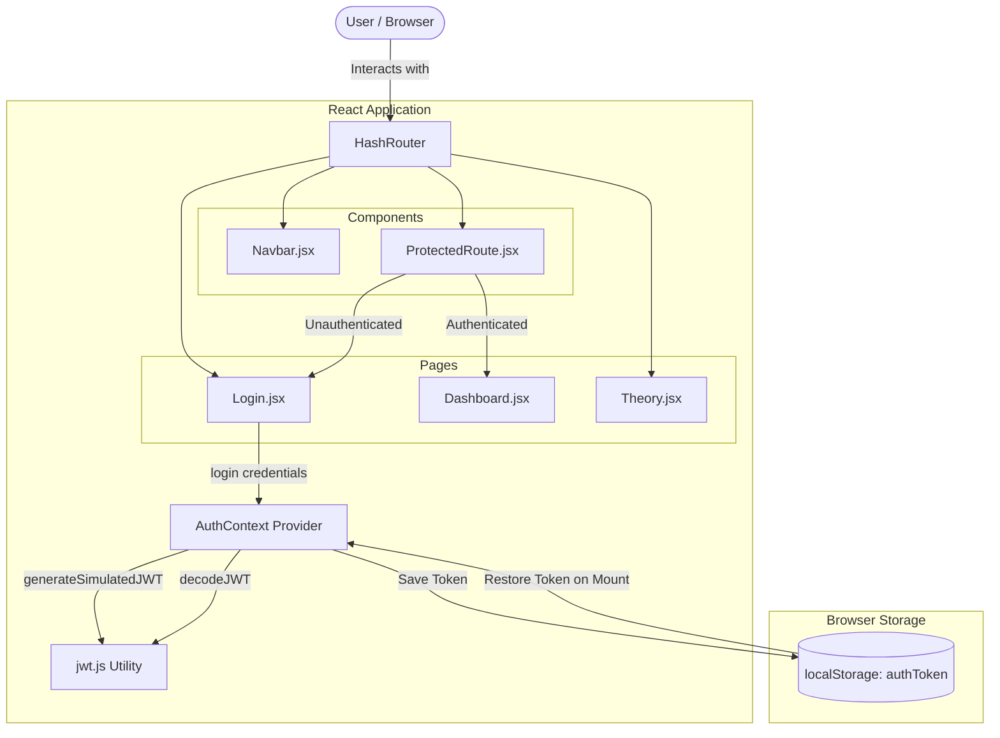
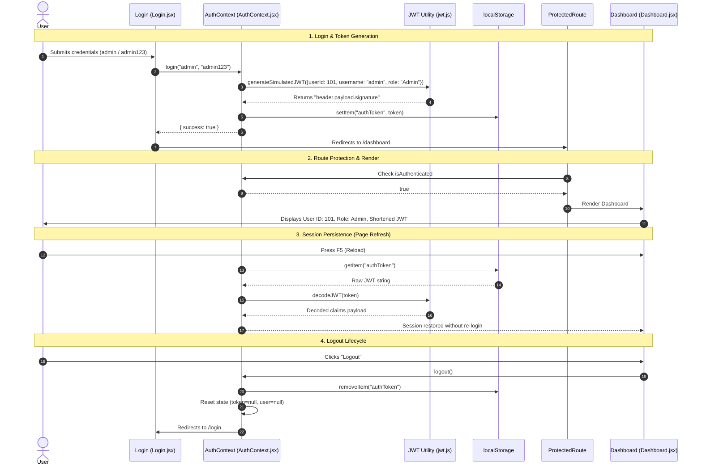

# Architecture & Flow Guide: Simple JWT Authentication

This document outlines the architecture, data flow, token lifecycle, and practical implementation details of this project.

---

## 1. System Architecture

---

## 2. End-to-End Sequence Flow

---

## 3. JWT Anatomy & Claims

A JSON Web Token consists of three parts separated by dots: `header.payload.signature`

| Component | Standard | Content in This Application |
| :--- | :--- | :--- |
| **Header** | Base64URL-encoded JSON | `{"alg": "HS256", "typ": "JWT"}` |
| **Payload** | Base64URL-encoded JSON claims | `{"userId": 101, "username": "admin", "role": "Admin", "iat": ..., "exp": ...}` |
| **Signature** | Cryptographic hash | Simulated hash representing HMAC-SHA256 signature |

---

## 4. Component Responsibility Matrix

| Component / File | Purpose | Key Logic |
| :--- | :--- | :--- |
| [`src/utils/jwt.js`](file:///c:/Users/Abhinav/Desktop/MST/src/utils/jwt.js) | Token encoding & decoding | `generateSimulatedJWT()`, `decodeJWT()`, Base64URL encode/decode |
| [`src/context/AuthContext.jsx`](file:///c:/Users/Abhinav/Desktop/MST/src/context/AuthContext.jsx) | Global auth state & persistence | `AuthProvider`, `useAuth()`, `login()`, `logout()`, `localStorage` sync |
| [`src/components/ProtectedRoute.jsx`](file:///c:/Users/Abhinav/Desktop/MST/src/components/ProtectedRoute.jsx) | Route guard | Inspects `isAuthenticated`; redirects unauthenticated users to `/login` |
| [`src/pages/Login.jsx`](file:///c:/Users/Abhinav/Desktop/MST/src/pages/Login.jsx) | Authentication UI | Controlled form, input validation, error alerts, demo credentials autofill |
| [`src/pages/Dashboard.jsx`](file:///c:/Users/Abhinav/Desktop/MST/src/pages/Dashboard.jsx) | Protected view | Displays user ID, role, shortened token, and color-coded JWT anatomy |
| [`src/pages/Theory.jsx`](file:///c:/Users/Abhinav/Desktop/MST/src/pages/Theory.jsx) | Viva & theory guide | Full explanation of auth flow, real vs. demo distinction, security considerations |
| [`src/App.jsx`](file:///c:/Users/Abhinav/Desktop/MST/src/App.jsx) | Routing configuration | Sets up `HashRouter` for GitHub Pages compatibility |

---

## 5. Security & Practical Notes

1. **Client Simulation**: In real systems, tokens must be created and signed on a secure backend using a private secret key. In this demo, tokens are simulated in the browser for educational transparency.
2. **`localStorage` vs. `HttpOnly` Cookies**:
   - `localStorage` allows client-side inspection and simple persistence, but is vulnerable to XSS.
   - Production systems commonly store tokens in `HttpOnly`, `Secure` cookies to prevent token theft by malicious scripts.
3. **Stateless Nature**: The application does not need a session database on the server because user identity claims (`userId`, `role`) travel inside the token itself.
